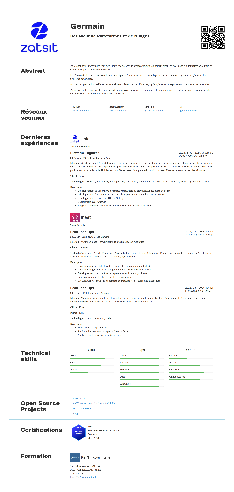

# CV Wonder Themes - Default

## Getting Started

```bash
cvwonder themes install https://github.com/germainlefebvre4/cvwonder-theme-default
cvwonder generate --input=cv.yml --theme=default
```

## Preview

HTML render:



From YAML (partial):

[CV Wonder - cv.yml](https://github.com/germainlefebvre4/cvwonder/blob/main/cv.yml)

## Template Functions

CV Wonder exposes helper functions you can call directly inside `index.html`.

### `qrCode`

Generates a QR code from a URL and returns an inline HTML `` tag with the image embedded as a PNG base64 data URI. Works in both HTML and PDF output.

**Signature:**
```
{{ qrCode <url> [options...] }}
```

**Options** are `"key=value"` strings:

| Key    | Description                        | Default     | Example          |
|--------|------------------------------------|-------------|------------------|
| `size` | Pixels per QR cell                 | `5`         | `"size=6"`       |
| `fg`   | Foreground (module) color (hex)    | `#000000`   | `"fg=#0077b5"`   |
| `bg`   | Background color (hex)             | `#ffffff`   | `"bg=#f5f5f5"`   |
| `ec`   | Error correction level (L/M/Q/H)   | `M` (15%)   | `"ec=H"`         |

Returns an empty string if `url` is empty — safe to use directly against model fields.

**Examples:**

```html
{{/* Simple — portfolio link in the header */}}
{{ if .Person.Site }}
  <div class="qr-contact">
    {{ qrCode .Person.Site }}
    <span>Portfolio</span>
  </div>
{{ end }}

{{/* Styled — LinkedIn QR in the sidebar */}}
{{ if .SocialNetworks.Linkedin }}
  {{ qrCode (printf "https://linkedin.com/in/%s" .SocialNetworks.Linkedin) "size=6" "fg=#0077b5" }}
{{ end }}

{{/* High error correction for a busy layout */}}
{{ qrCode .Person.Site "size=5" "fg=#333333" "ec=H" }}
```

